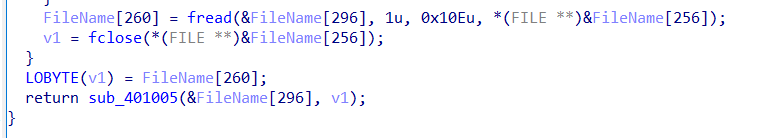
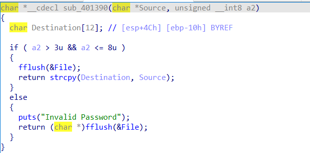
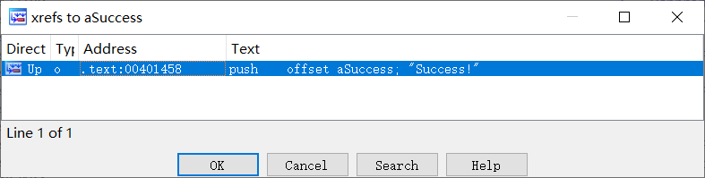
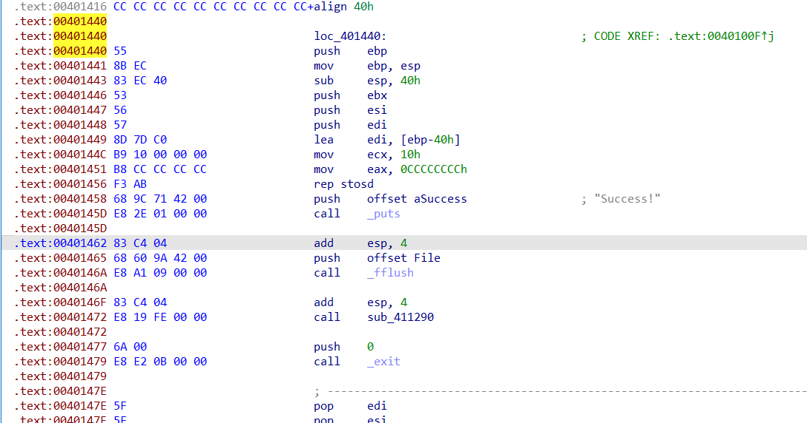
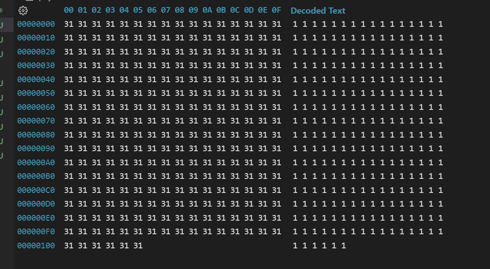
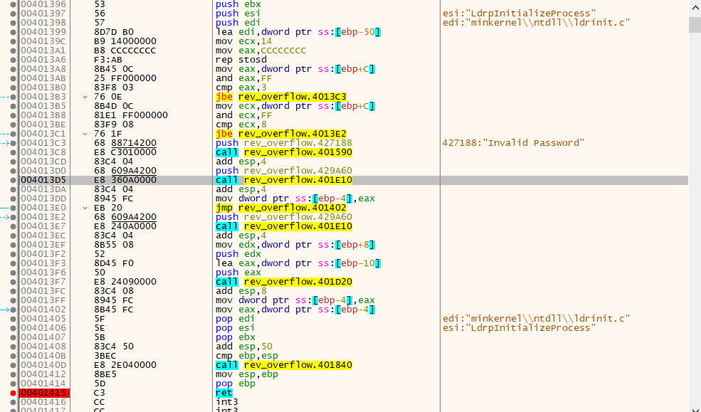
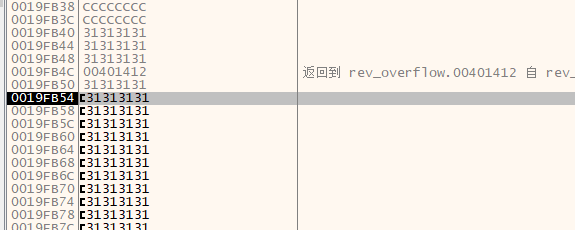
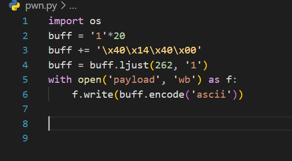
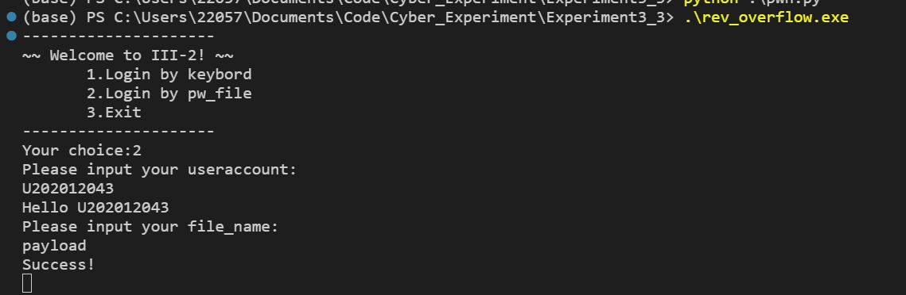

# 逆向分析（一）

# 1. 定位程序漏洞位置

跟随程序流，发现fread函数最多读取270个字符

而LOBYTE(v1) = fileName[260]可能导致整数溢出

sub_401390中要求a2（字符串长度为3~8）之间

因此，可以尝试输入长度为262的字符串，整数溢出后长度为6，符合条件。

strcpy时存在栈溢出可能，此处可以利用其控制程序流

# 2. 定位函数偏移地址

搜索Success!字符串找到其交叉应用处

sub0x401440处函数可以输出Success!

# 3. 构建二进制输入文件

利用动态调试，测试栈溢出位置到字符串起始处的长度

构造长度为262的字符串

动态调试

找到存在栈溢出的函数，在其ret处打上断点。

运行至断点处。

此时esp为0x19FB54, 变量起始为0x19FB40,差值为20

因此在变量起始20处插入目标函数地址。

# 4. 测试程序

测试成功，输出Success！

