# 四、逆向分析（2)

# 1. 寻找漏洞位置

通过main函数追踪程序流，在输入choice后，跳转到sub_40100A函数。

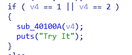

sub_40100A跳转至0x401400处。

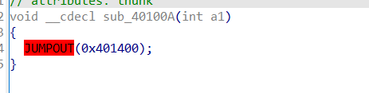

查看0x401400处，前面函数正常。

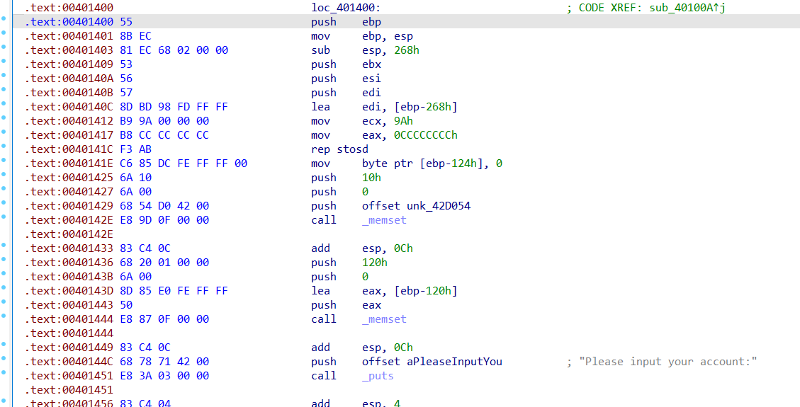

后面出现了数据与代码混杂的情况，未能正常解析。

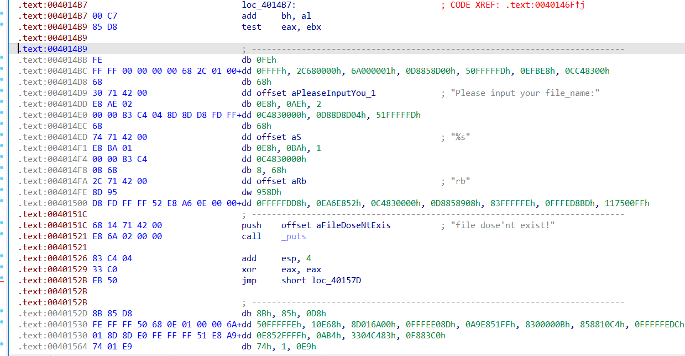

在IDA中Options->General->Number of opcode bytes中将操作码字节设为8，此时IDA显示如下。

为了使代码恢复正常，手动将指定字节分别解析为代码和数据

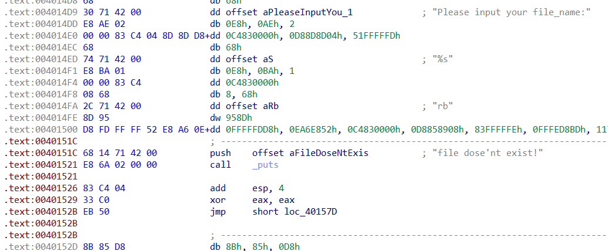

在字符串"Please input your file_name:"后应该为call指令，而call指令对应操作码为E8，因此从E8开始解析为代码。

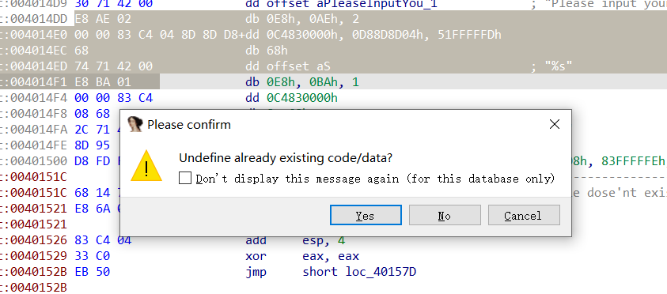

强制解析为代码。后半部分已正常。

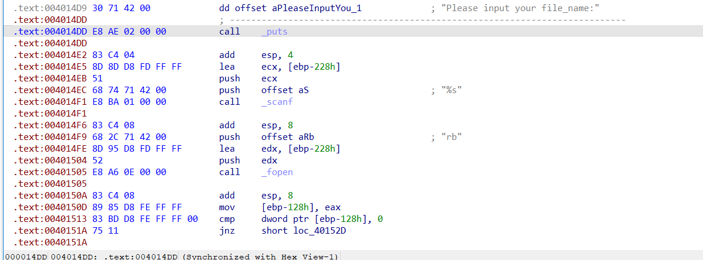

在call函数前，应该为参数入栈操作，而push指令对应的操作码为68，将68开始的解析为代码

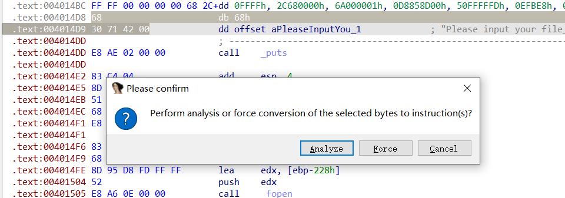

将C7开头的指令先改为data，后解析为代码，表示一个MOV语句。

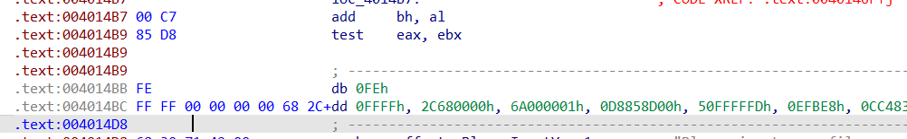

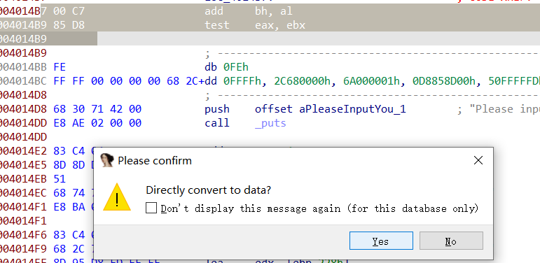

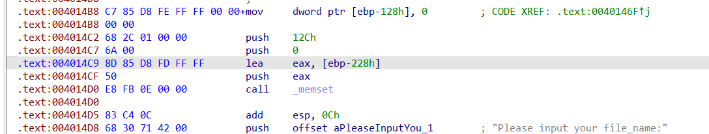

0x004014B2处的指令显然不在此，因此将E9作为指令码的开始，得到第一个花指令E8：

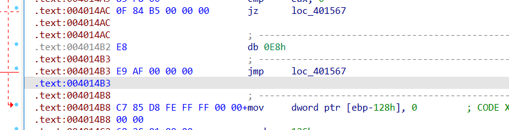

恢复代码后，将sub_401400整个函数（开头到retn）解析为一个函数，反编译后得到如下结果：

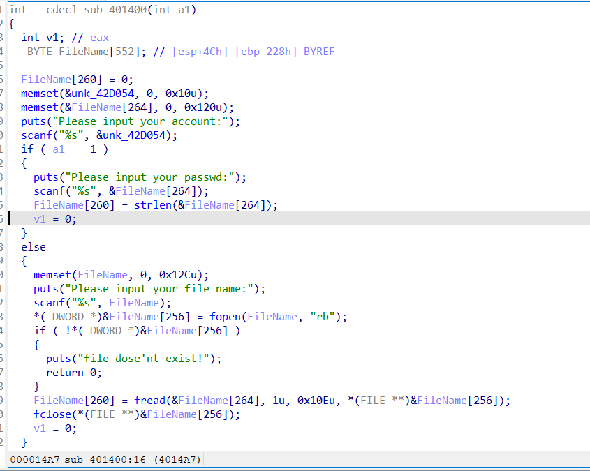

在代码最后同样出现了LOBYTE和strcpy函数，存在整数溢出和栈溢出风险。

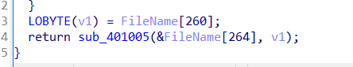

 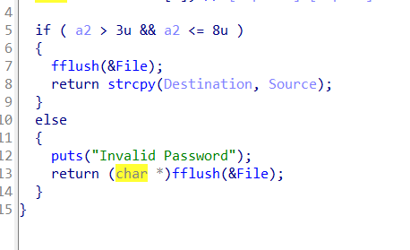

同样构造一个长度为256+6=262的字符串进行攻击，而Destination位置为ebp-Ch,需要填满C，且将ebp覆盖，所以溢出点位于16偏移处。

# 2. 寻找输出正确信息的函数

在字符串表中尝试寻找Success!，没有结果，尝试搜索Flag: 作为切入点。

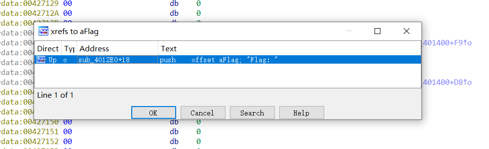

寻找其交叉引用处。推测此处输出了Flag的值。

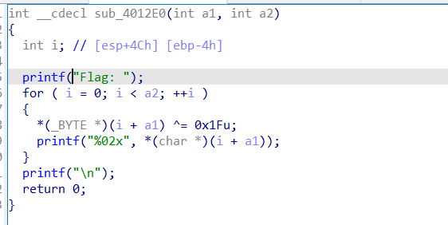

查看该函数(sub_4012E0)的交叉引用

sub401019进行调用

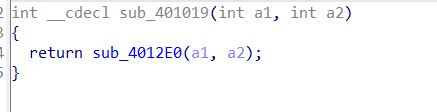

sub401230进行调用

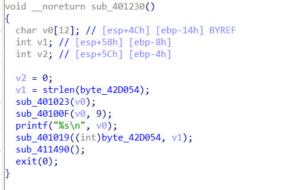

在该函数中，首先输出了v0的值，后调用了输出flag的函数

猜测v0因为字符串"Success!"

在sub_401023中，调用了sub_4011B0,分析sub_4011B0

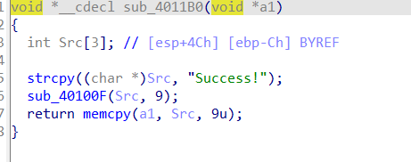

该函数首先将"Success!"赋给 Src，而Src长度为3，后调用sub_40100F函数，后调用sub_401390。

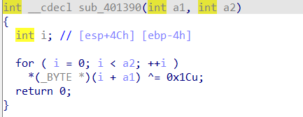

将字符串"Success!"各位与0x1Cu异或。存入a1中。

sub_401023调用后v0的值为"Success!"与0x1Cu异或

而sub_40100F调用后，v0的值又变回"Success!"。

因此该函数即为输出Success的函数。

# 3. 构造二进制输入文件

已知溢出点位于16偏移出，且目标函数位于sub_401230，构造如下输入文件。

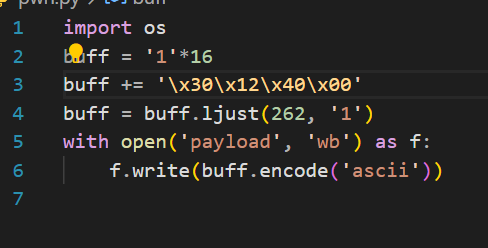

# 4.测试

测试成功，输出Success!与flag

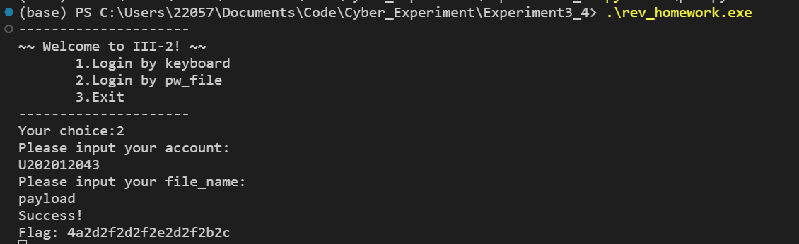