# Exp 3_5 snort 入侵检测系统监测 NMAP 扫描

# 1. snort入侵检测系统

## 1.1 检测配置

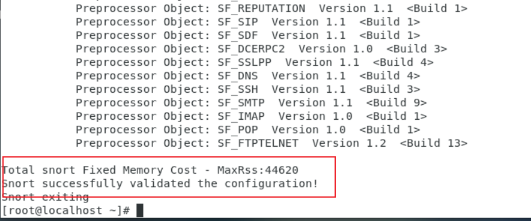

snort 部署成功

## 1.2 编写检测来自ping的数据包

vi `/etc/snort/rules/local.rules`

写入规则 ` alert icmp any any -> 192.168.1.2 any (msg:"ping ping!!!";reference:"ARobot";sid:2`

## 1.3 激活snort控制台检测流量

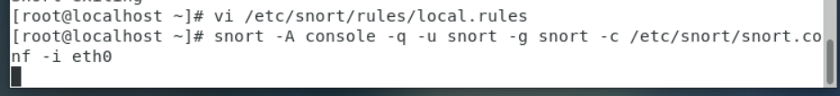

输入命令 snort -A console -q -u snort -g snort -c /etc/snort/snort.conf -i eth0 ,激活 snort 控制台检测流量。

## 1.4 ping

从ip为192.168.1.254的虚拟机ping 192.168.1.2。

## 1.5 结果

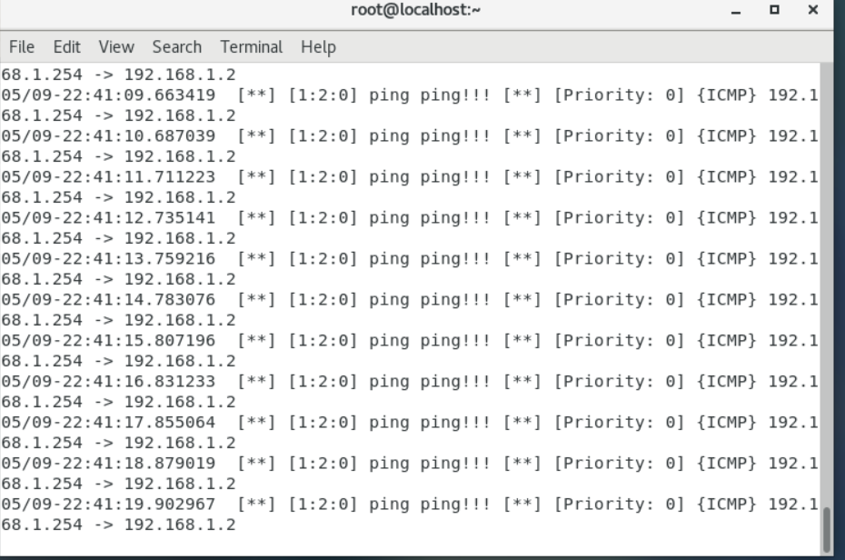

检测到了ping的操作，并打印了详细内容。

## 1.6 编写规则检测nmap ping扫描

vi /etc/snort/rules/local.rules，修改规则为 alert icmp any any -> 192.168.1.2 any (msg: "NMAP ping sweep Scan"; dsize:0;sid:10000001; rev: 1;)

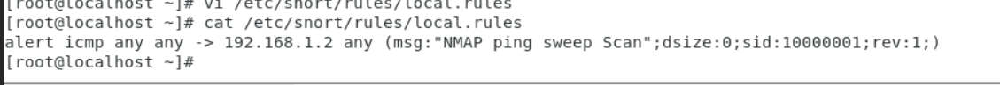

## 1.7 激活控制台检测流量

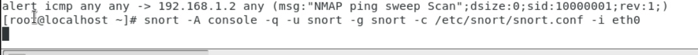

## 1.8 进行nmap ping扫描

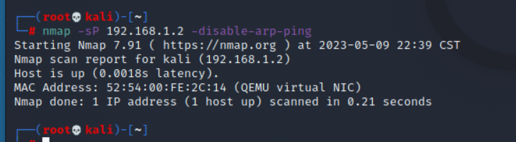

## 1.9 输出警告信息

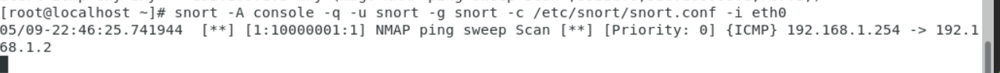

## 1.10 编写规则检测nmap的端口爆破、连接及漏洞利用行为规则

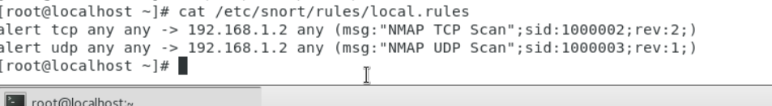

## 1.11 激活snort控制台检测流量

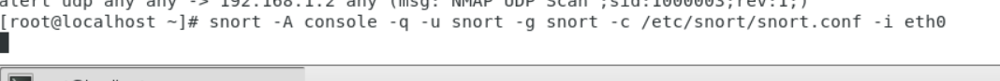

## 1.12 使用nmap进行TCP和UDP扫描

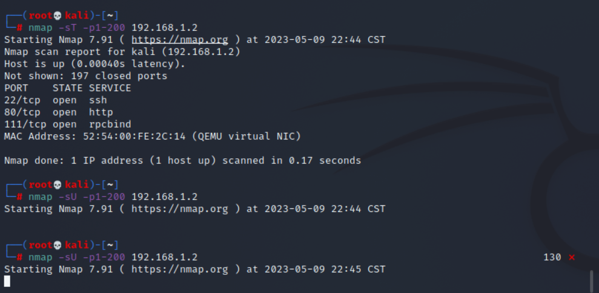

## 1.13 检测到扫描

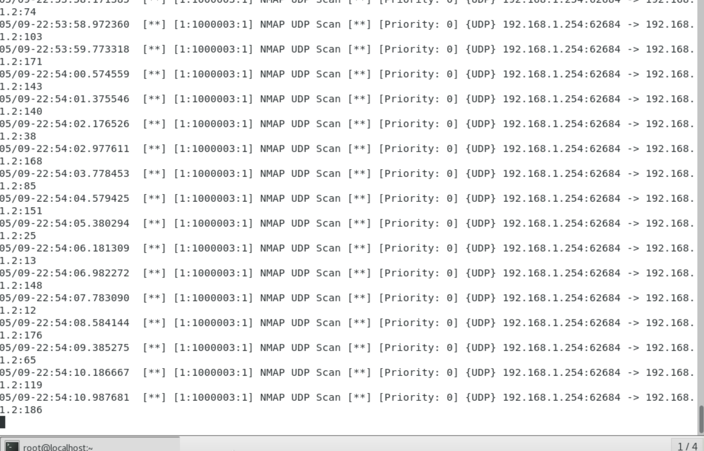

## 1.14 编写规则检测Fin、PSH 和 URG 发送数据包

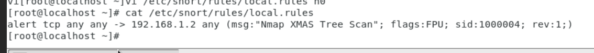

## 1.15 激活 snort 控制台检测流量

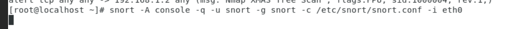

## 1.16 进行 XMAS 扫描

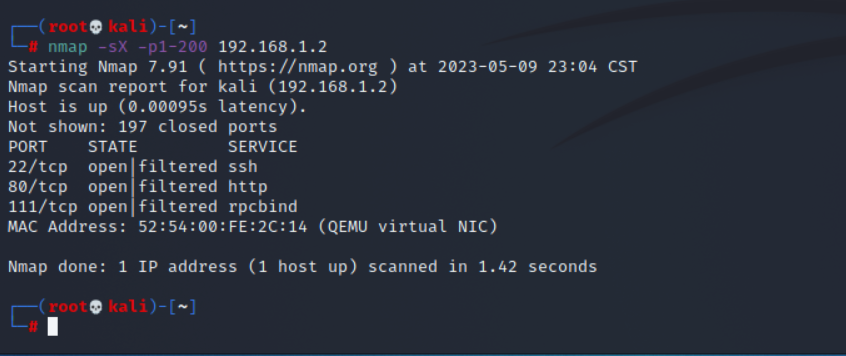

## 1.17 查看警告信息

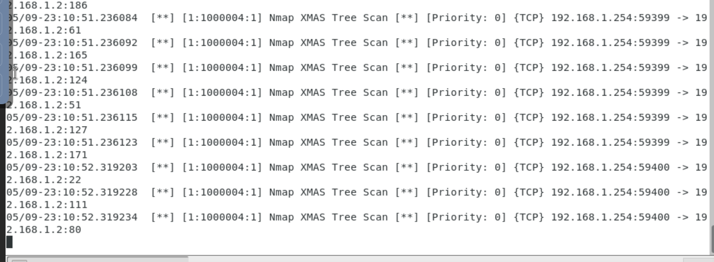

## 1.18 检测Fin扫描

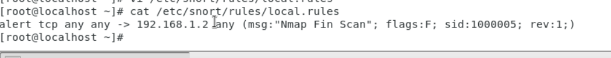

## 1.19 激活控制台流量

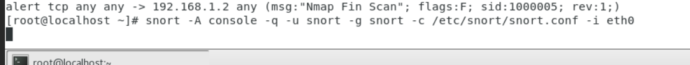

## 1.20 Fin扫描

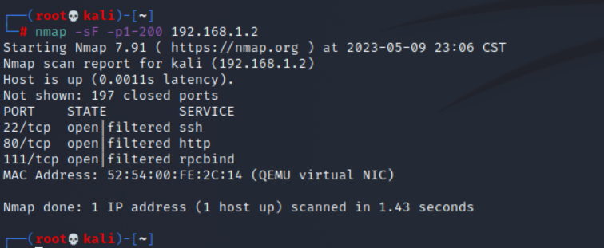

## 1.21 警告信息

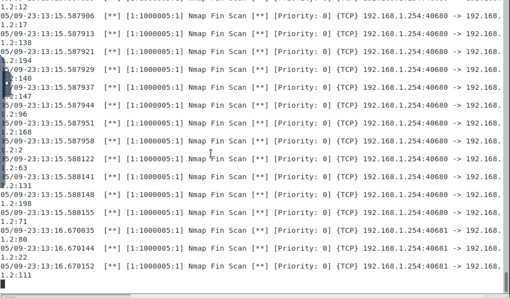

## 1.22 检测NULL扫描

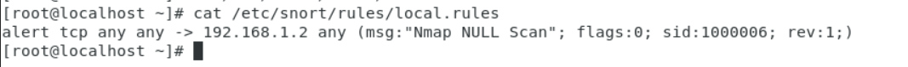

## 1.23  激活控制台流量

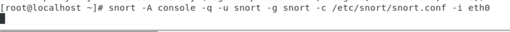

## 1.24 nmap null扫描

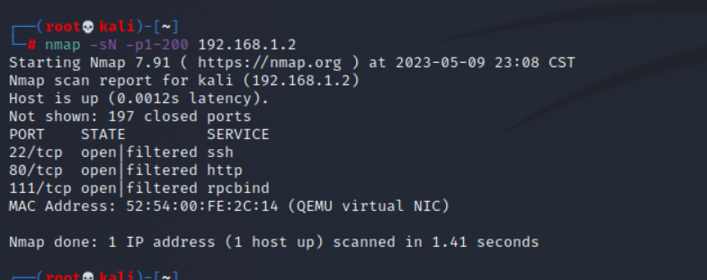

## 1.25 输出警告信息

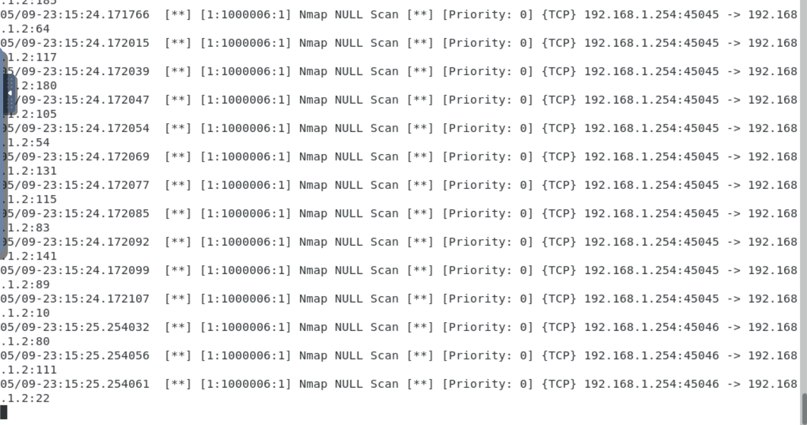

