# Exp3_6 snort 入侵检测系统监测 ddos 攻击

# 1. 检测Land攻击

1、添加Land攻击规则，修改snort的配置文件

若检测到来自HOME_NET任意端口到HOME_NET : 80端口的任何数据包，则输出警告信息。

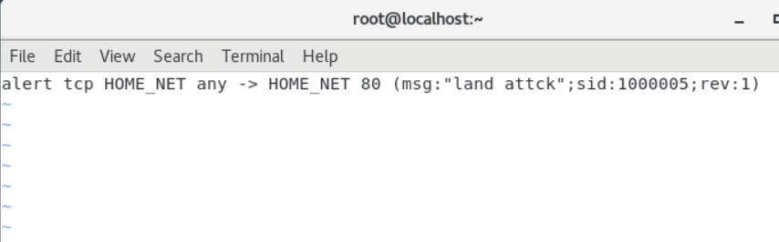

启动控制台检测

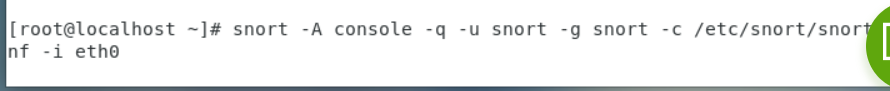

2、实施攻击

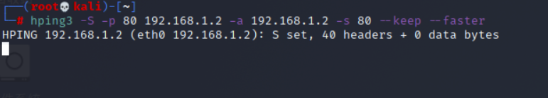

3、检测到攻击，发出警告

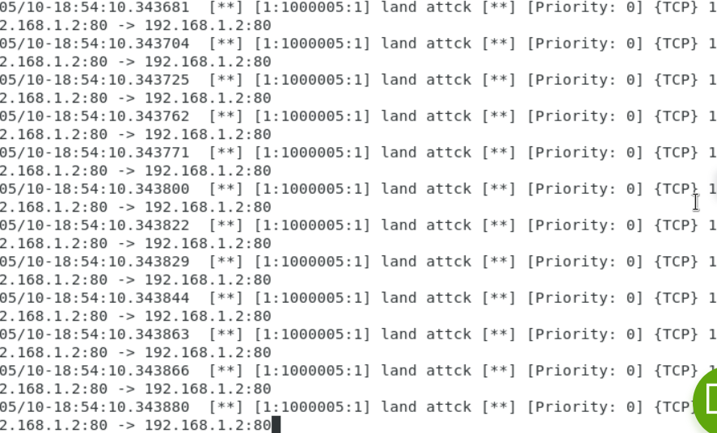

# 2. 检测SYN Flood洪水攻击

1、编写规则

若在一分钟内出现超过20此SYN标志位的TCP包时，就产生警告信息。

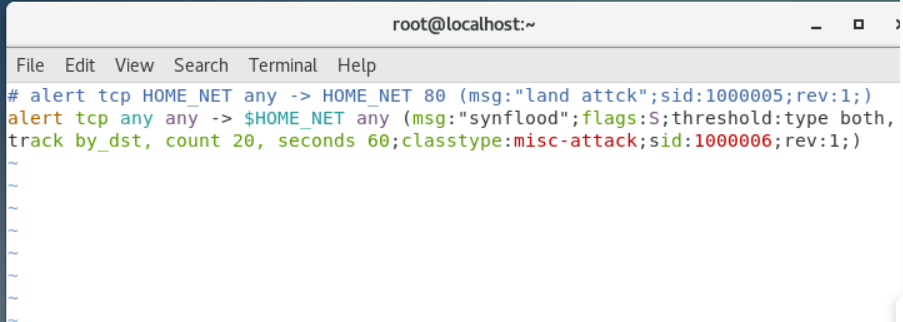

启动控制台检测

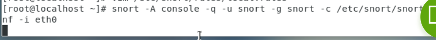

2、实施攻击

攻击机使用hping3执行洪泛攻击。

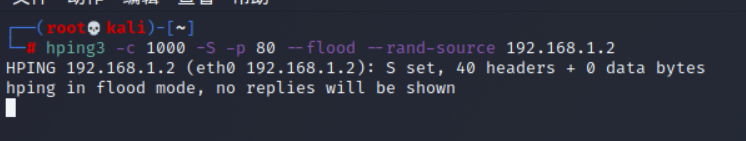

3、检测到攻击，警告

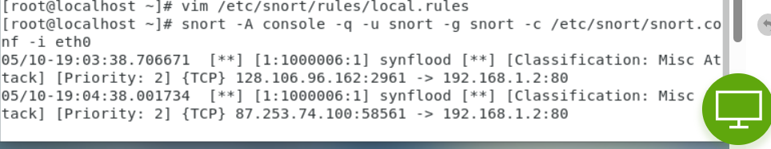

# 3. 检测UDP洪水攻击

1、修改规则

加入检测UDP洪水攻击的规则

在一分钟内检测到超过10条UDP包，则发出警告为UDP洪水攻击。

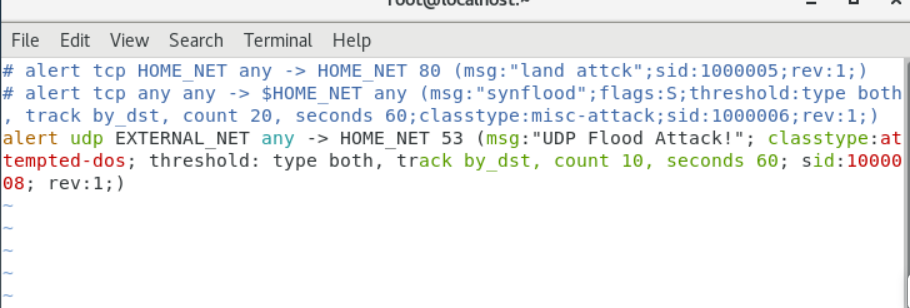

控制台启动检测

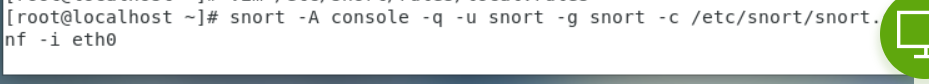

2、 攻击机发起UDP洪水攻击

使用hping3进行UDP洪水攻击。

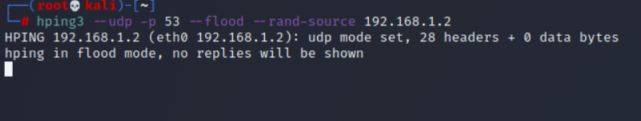

3、检测到攻击，发出警告

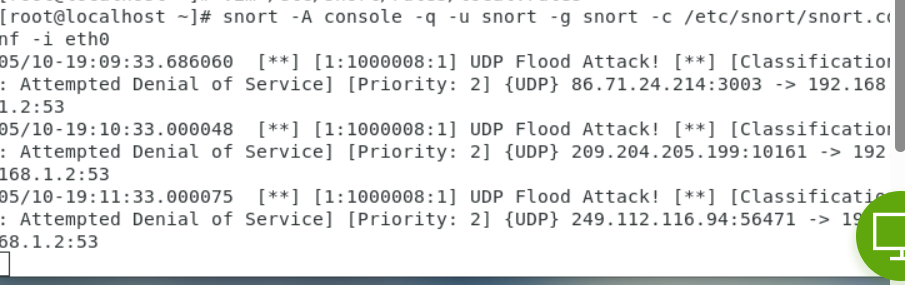